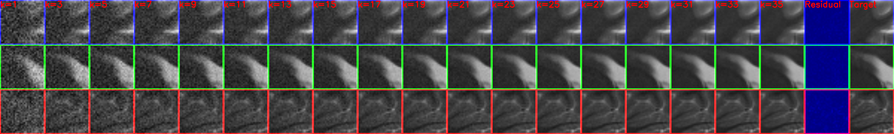
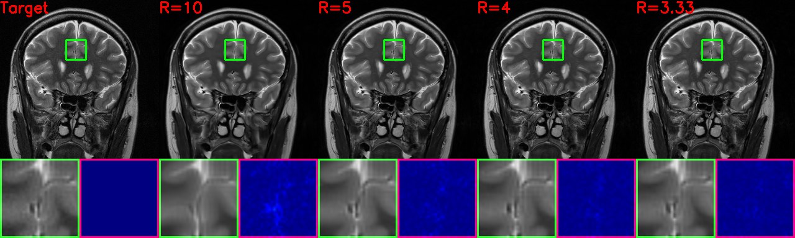
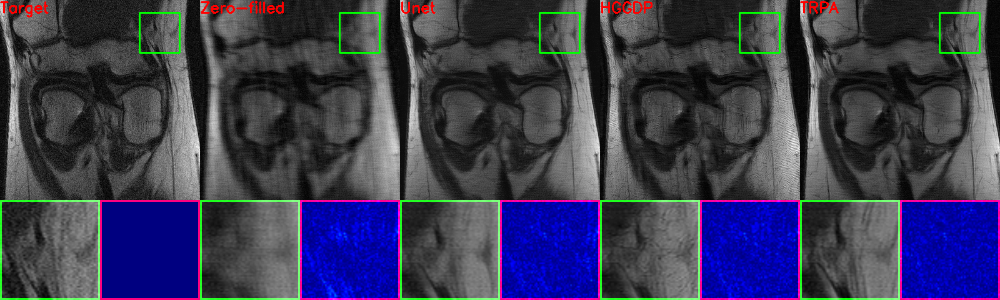
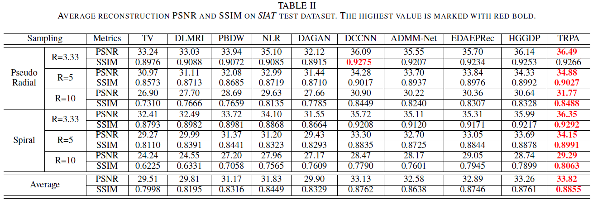

# Truncated Residual Based Plug-and-Play ADMM Algorithm for MRI Reconstruction ([TRPA](10.1109/TCI.2022.3145187))

**Authors**: Ruizhi Hou, Fang Li$^*$, and Guixu Zhang

**Abstract**:

Plug-and-play alternating direction method of multiplier (PnP-ADMM) can be used to solve the magnetic resonance
imaging (MRI) reconstruction problem, which allows plugging the pre-trained denoiser to solve the denoising-like subproblem in ADMM. Many researchers explore the property of the denoiser to ensure the convergence of PnP-ADMM. However, it is hard to prove that the pre-trained deep learning based denoiser satisfies the assumption. In this paper, we propose a truncated residual based PnP-ADMM that solves the denoising-like subproblem by subtracting the predicted residual of the denoising neural network. Instead of establishing the assumption for the denoiser, we truncate the residual with a variable that tends to zero. In this way, the iterative sequence of the proposed algorithm can strictly converge to a fixed point. This truncated residual based plug-and-play ADMM algorithm is called TRPA. Moreover, to allow the denoiser to deal with the continuous noise level, we design a continuous conditional instance normalization (CCIN) layer. With the truncated residual and the powerful neural network with CCIN, the TRPA has strict convergence property as well as great image restoration ability. Qualitative and quantitative results show that our proposed TRPA is comparable with state-of-the-art methods. It is worth noticing that TRPA as a plug-and-play method is comparable with the end-to-end model at the leaderboard of fastMRI challenge.

**Intermediate results during the iteration**:



**Visual results under radial sampling at different accelerated factors**:


**Visual results on fastMRI dataset at R=4**:



**Quantitive comparison with related works**:



To adopt our code for your own dataset, the first step is preparing the training and testing data using our code.
```bash
cd src/data
```
Run the python code.
```bash
python prepare_data.py
```
Please modify the code by yourself for different datasets.

The second step is to train the denoiser.
```python
python main_train_denoiser.py --config_file ./options/SIAT_TRPA.yaml
```
where `./options/SIAT_TRPA.yaml` consists of all the parameters setting.

Then we can reconstruct the MR image using the pre-trained denoiser. Our pre-trained weights using SIAT and fastMRI dataset are in [releases](https://github.com/Houruizhi/TRPA/releases). To use the pre-trained weights, you should decompress the files into `./checkpoints`. You can see the jupyter notebook files to know how to use the denoiser. Or you can run `test_on_dataset_*.py` directly to evaluate on different datasets.

Train and test dataset:

* SIAT: [Train](https://github.com/yqx7150/SIAT_MRIdata200), [Test](https://github.com/yqx7150/EDAEPRec/tree/master/test_data_31)
* [fastMRI](https://fastmri.org/)

To use our code, please cite our papers as

```latex
@ARTICLE{TRPA,
  author={Hou, Ruizhi and Li, Fang and Zhang, Guixu},
  journal={IEEE Transactions on Computational Imaging}, 
  title={Truncated Residual Based Plug-and-Play ADMM Algorithm for MRI Reconstruction}, 
  year={2022},
  volume={8},
  number={},
  pages={96-108},
  doi={10.1109/TCI.2022.3145187}}

@article{IDPCNN,
title = {IDPCNN: Iterative denoising and projecting CNN for MRI reconstruction},
journal = {Journal of Computational and Applied Mathematics},
volume = {406},
pages = {113973},
year = {2022},
issn = {0377-0427},
doi = {https://doi.org/10.1016/j.cam.2021.113973},
url = {https://www.sciencedirect.com/science/article/pii/S0377042721005719},
author = {Ruizhi Hou and Fang Li},
keywords = {Magnetic resonance imaging, MRI reconstruction, Image denoising, CNN}
}
```

